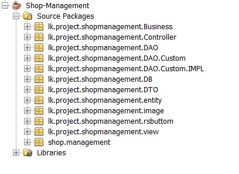
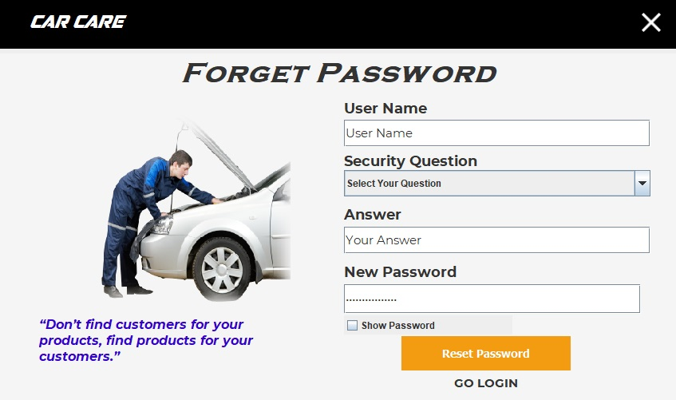

# Care Care Application (java)

## About Care Care Application

   <body> This application can use to Manage Vehicle Spare Parts Shop Activitys. There Selling parts and buy a spare parts lots.
        This Application can Manage there transaction, buying , selling, update storage, view storage Functions
   </body>

### User Features

    <ul>
        <li>First User Want to log there account(Login)</li>
        <li>If he can’t Remember his password ? He can reset it using their security question.</li>
         &nbsp &nbsp(user can select it account create) 
        <li>After login he can change password and security question.</li>
        <li>User can create new User Account.</li>
    </ul>
 

 
 ### Managing Features
 

       <ul>
           <li>Add Vehicle / Delete Vehicle / Update Vehicle / Search Vehicle</li>
           <li>Add  Parts / Delete Parts / Update Parts / Search Parts</li>
           <li>Can view All Previous Payment and Payment Details</li>
           <li>Search specific bill using vehicle number or payment date.</li>
           <li>Store window he can view All parts and details.</li>
           <li>Operation window can view all today operation (payments and details)</li>
           <li>Specially use can view graphic charts (witch parts is mostly sell?)</li>
           <li>Monthly operation window can view all transaction with any month and user can compare using graphic charts </li>
           <li>User can change their Password and security question and create new user.</li>
       </ul>
 

 
 ### Technologies Used
 

      <body>I used Java Platform using NetBeans and MySql for Database. Additional I used two Dependancies
             <ul>
             <li><a href="https://jar-download.com/artifacts/org.jfree/jfreechart/1.0.14/source-code">Jfree Charts Dependancies</a></li>
             <li><a href="http://plugins.netbeans.org/plugin/73575/rojerusan-lib-jar">Rs Button Dependancies</a></li>
             <li><a href="https://dev.mysql.com/downloads/">My SQL Database</a></li>
             </ul>
         </body>
        
 This Project I used Layered Architecture(<a href="https://www.developer.com/design/article.php/10925_3808106_4/Introducing-Enterprise-Java-Application-Architecture-and-Design.htm">Enterprise Java Application Architecture and Design</a>). Including Interfaces and Java Classes.

         
 

 

 
 # InterFaces
 ## Splash Screen
 

       
   This is the Loarding Screen (Splash Screen).
   when user open application first load this screen.
 

  
  
 
 ## Login Screen
 

       
   This is the Login Screen.
   User want to enter their user name and password.
 

  
  
 
  ## Forget Psssword Screen
 

       
   This is the Forget Password Screen.
   User want to Insert
   <ul>
      <li>User Name</li>
      <li>Security Question</li>
      <li>Answer</li>
      <li>New Password</li>
      </ul>
 

  
  
 
 ## Payment Transaction Screen Side Menu
 

       
   Left Side have Main menu bar.
   User can hide it.
 

 
 ## Side Menu in Hide Position
  
  
  
 
 ## Payment Transaction Screen
 

       
   This is the Payment Transaction Screen.
   It has many Features
   <ul>
      <li>Order ID automaticly genarated</li>
      <li>Date also automaticly genareted</li>
      <li>User want to select Vehical Number (after select vehical number automaticly filling Owner name)</li>
      <li>user want to select product id and input quntity</li>
      </ul>
 

  
  
 
 ## Payment Transaction Screen (Adding Items)
 

       
   User can add items. total value is automaticaly calculated.
 

  
  
 
 ## Close Window Button 
 

    
   

    
    
   
 ## Minimize Window Button 
 

    
   

    
    
   
 ## Maximize Window Button 
 

    
   

    
    
 
 ## Vehicle Dashboard
 

       
   This is the Vehical Management Window.
   It has many Features
   <ul>
      <li>Add new Vehicle</li>
      <li>Delete Vehicle</li>
      <li>Search Vehicle</li>
      <li>Update Vehicle</li>
      <li>All Register Vehical</li>
      </ul>
 

  
  
 
 ## Parts Dashboard
 

       
   This is the Spare Parts Management Window.
   It has many Features
   <ul>
      <li>Add new Parts</li>
      <li>Delete Parts</li>
      <li>Search Parts</li>
      <li>Update Parts</li>
      <li>All Parts</li>
      </ul>
 

  
   
 
 ## Previous Payments & Payment Details
 

       
   This window display all previous payments.
   If you click any payment you can see all the details of that payment.
   User can search previous payment bill using two types
   <ul>
      <li>Vehical Number Base</li>
      <li>Payment Date Base</li>
      <li>Both Two of Them</li>
   </ul>
 

  
   
 
 

    
   When user select ant payment he can check all payment details according to the that customer_id
   

   
 ## Storage Screen
 

    
   User can see all product and available Quntity.
   It's Very help to Make a Business Deision.
   

    
    
   
   ## Today Opperation Screen
   

       
   This is Daily Opperation Monitoring Screen.
   This screen giving valuble data.
   <ul>
      <li>Total Selling count in Day</li>
      <li>Total Income per Day</li>
      <li>Mostly Selling Brand within Day</li>
      <li>Grapical User Charts</li>
      </ul>
 

  
   
  This Java chart Help to find most selling brand in day.
  
  ## Mounthly Opperation Screen
   

       
   Using this window User can view Mounthly selling Transaction Count and total mounthly income.
   User can check one by one 12 mounth
   <ul>
      <li>Fitness tracker</li>
      <li>Total mounthly Transaction count</li>
      <li>Total mounthly Transaction count</li>
      <li>Grapical User Charts</li>
      </ul>
 

  
   
  This Java chart Help to find most selling Mounth in this Year.
  
  
   ## Parts Dashboard
 

       
   This is the User Control Panel
   It has many Features
   <ul>
      <li>change password</li>
      <li>Change Security question answer</li>
      <li>Search Account</li>
      <li>Update Account</li>
      <li>Delete Account</li>
      <li>Create New User</li>
      </ul>
 

  
   
 
 Thank You...!! Any Developer can develop more Please Do it.........!! It plesure to meee....!!
