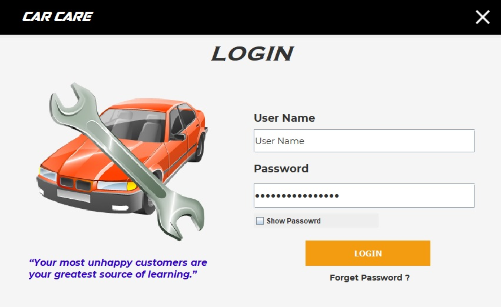

# Care Care Application (java)

## About Care Care Application

   <body> This application can use to Manage Vehicle Spare Parts Shop Activitys. There Selling parts and buy a spare parts lots.
        This Application can Manage there transaction, buying , selling, update storage, view storage Functions
   </body>

### User Features

    <ul>
        <li>First User Want to log there account(Login)</li>
        <li>If he can’t Remember his password ? He can reset it using their security question.</li>
         &nbsp &nbsp(user can select it account create) 
        <li>After login he can change password and security question.</li>
        <li>User can create new User Account.</li>
    </ul>
 

 
 ### Managing Features
 

       <ul>
           <li>Add Vehicle / Delete Vehicle / Update Vehicle / Search Vehicle</li>
           <li>Add  Parts / Delete Parts / Update Parts / Search Parts</li>
           <li>Can view All Previous Payment and Payment Details</li>
           <li>Search specific bill using vehicle number or payment date.</li>
           <li>Store window he can view All parts and details.</li>
           <li>Operation window can view all today operation (payments and details)</li>
           <li>Specially use can view graphic charts (witch parts is mostly sell?)</li>
           <li>Monthly operation window can view all transaction with any month and user can compare using graphic charts </li>
           <li>User can change their Password and security question and create new user.</li>
       </ul>
 

 
 ### Technologies Used
 

      <body>I used Java Platform using NetBeans and MySql for Database. Additional I used two Dependancies
             <ul>
             <li><a href="https://jar-download.com/artifacts/org.jfree/jfreechart/1.0.14/source-code">Jfree Charts Dependancies</a></li>
             <li><a href="http://plugins.netbeans.org/plugin/73575/rojerusan-lib-jar">Rs Button Dependancies</a></li>
             <li><a href="https://dev.mysql.com/downloads/">My SQL Database</a></li>
             </ul>
         </body>
        
 This Project I used Layered Architecture(<a href="https://www.developer.com/design/article.php/10925_3808106_4/Introducing-Enterprise-Java-Application-Architecture-and-Design.htm">Enterprise Java Application Architecture and Design</a>). Including Interfaces and Java Classes.

         
 

 

 
 ### InterFaces
 ##### Splash Screen
 

       
   This is the Loarding Screen (Splash Screen).
   when user open application first load this screen.
 

  
  
 
 ##### Login Screen
 

       
   This is the Login Screen.
   User want to enter their user name and password.
 

  
  
 
  ##### Forget Psssword Screen
 

       
   This is the Forget Password Screen.
   User want to Insert
   <ul>
      <li>User Name</li>
      <li>Security Question</li>
      <li>Answer</li>
      <li>New Password</li>
      </ul>
 

  
  
 
 
 
 
 
 
 
 
